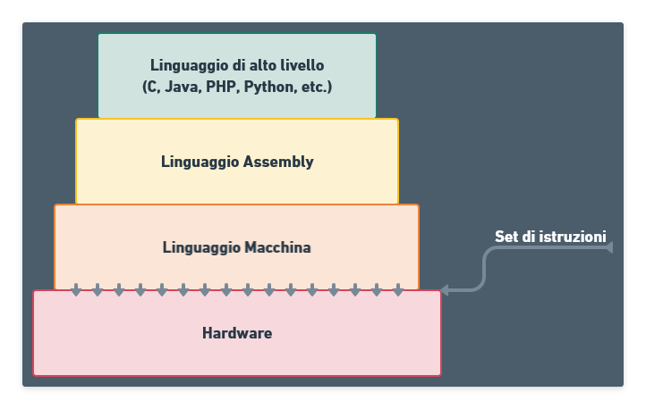
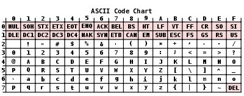
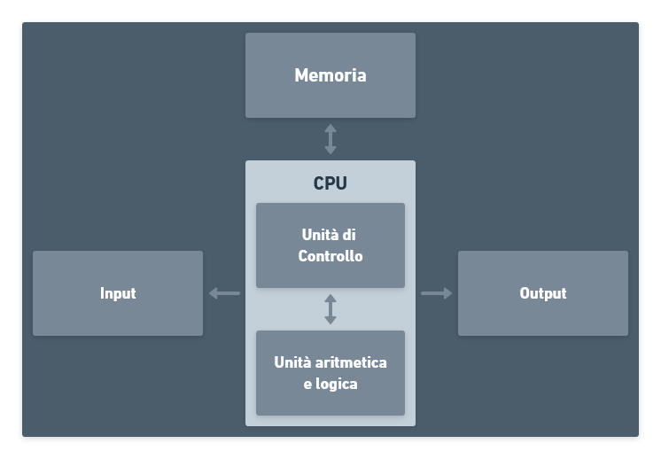

# Introduzione ai calcolatori

## **Sistemi di elaborazione dell'informazione**

Gli elementi principali di un sistema di calcolo si suddividono in due categorie:

-   **Hardware**, rappresenta la parte fisica dell'elaboratore, costituita da componenti elettronici ed elettromeccanici. L'hardware è tutto ciò che può essere toccato.
-   **Software**, costituito da tutti i programmi che consentono all'hardware di realizzare compiti specifici. Il software non è tangibile.

Essi si completano, senza software l'hardware è inutile, e viceversa.

---

## Software

**Sono presenti due tipi di software:**

-   **Software di Base:** funzionale all'utilizzo del calcolatore e delle due periferiche, comprende:
    -   **Sistema operativo,** che permette di usare il computer al meglio;
    -   **Programmi Traduttori** di linguaggi di programmazione.

*   **Software Applicativo:** mostra all'utente il calcolatore come una macchina virtuale utilizzabile per la risoluzione di problemi specifici. Comprende tutte le applicazioni adoperate dagli utenti: videoscrittura, foglio elettronico, ecc. Anche le app dei sistemi mobile rientrano in questa categoria.

Saper impostare il PC al meglio è importante per poter utilizzare al meglio i software applicativi.

---

## **Sistema operativo**

Senza sistema operativo non sarebbe possibile interagire con la macchina. È molto importante, ma questa è la sua unica funzione. Esso è l'insieme di programmi che:

-   servono alla gestione dell'hardware;
-   permettono l'interazione tra l'utente e l'hardware del calcolatore.

Le funzioni del Sistema Operativo sono svariate: comunicare con l'utente, ovvero ricevere ed eseguire i comandi e comunicare eventuali errori, gestire l'allocazione della memoria e di tutte le risorse del calcolatore, acquisire i dati in ingresso dalla tastiera e dagli altri dispositivi di input, inviare i risultati al video e agli altri dispositivi di output, leggere e scrivere i dati nella memoria di massa.

---

## **Architettura di Von Neumann**

Ogni calcolatore utilizza l'architettura di _Von Neumann_ e le componenti fondamentali di un calcolatore sono:

-   Unità centrale di elaborazione (o CPU) che preleva le istruzioni dalla memoria e le esegue, legge/scrive dati dalla memoria
-   Memoria principale (RAM, ROM) che contiene i dati e le istruzioni dei programmi
-   Memoria secondaria o di massa (HD, CD, DVD, ecc.) per memorizzare dati e programmi in maniera permanente
-   Dispositivi d'input (tastiera, mouse, touchpad, ecc.) per l'inserimento dei dati
-   Dispositivi di output (monitor, stampante, ecc) per ricevere i risultati.

---

## **Memoria Principale RAM (Random Access Memory)**

Contiene dati e istruzioni che sono oggetto di elaborazione da parte del processore.

L'elemento base della Ram è la cella di memoria, le cui caratteristiche sono:

-   Può assumere solo due stati (0/1);
-   È possibile scrivere nella cella per cambiare lo stato;
-   È possibile leggere lo stato della cella;
-   È organizzata come una sequenza di locazioni di memoria.

Ogni locazione è una sequenza di $n$ bit, in genere $8$ o $16$. Ogni locazione di memoria è individuata da un indirizzo univoco che ne specifica
la posizione. L'indirizzo di memoria è un numero binario intero positivo.

---

## **Memoria ROM (Read Only Memory)**

È una memoria a sola lettura, che contiene informazioni permanenti e non modificabili, i dati sono impostati nel chip durante il processo di fabbricazione ed è usata per memorizzare istruzioni di sistema come ad esempio le istruzioni necessarie per l'avvio del sistema operativo e per il riconoscimento di tutte le periferiche.

---

## **Memoria di Massa**

Le memorie di massa (o memorie secondarie) sono utilizzate per memorizzare grandi volumi di dati in modo persistente.

---

## **Memoria Cache**

È una memoria che usa una tecnologia veloce SRAM contro una più lenta DRAM della memoria principale.

Non visibile al software, è gestita dall'hardware, che memorizza i dati recenti usati dalla memoria primaria.

La Cache ha la funzione di aumentare le prestazioni del sistema, riducendo il traffico del bus di sistema e della memoria principale che è uno dei maggiori colli di bottiglia.

---

## **Codici di caratteri**

Sono dei **codici alfabetici,** cioè un insieme di caratteri che possono comprendere:

-   Caratteri alfabetici minuscoli e maiuscoli, ad esempio $\text{``\(a\)'',\ldots, ``\(z\)''}$ o anche $\text{``\(A\)'',\ldots, ``\(Z\)''}$;
-   Caratteri numerici, come $\text{``\(0\)'', ``\(1\)'',\ldots , ``\(9\)''}$;
-   Segni di punteggiatura, ad esempio $\text{``,'', ``.'', ``!'',}$ etc;
-   Altri simboli stampabili, come $\text{``@'', ``\(+\)'',}$ etc;
-   Caratteri di controllo del tipo $\text{NUL, FF,}$ etc.

I principali codici di caratteri sono:

-   ASCII;
-   UNICODE.

---

## **Codice ASCII (American Standard Code for Information Interchange)**

È un sistema di **codifica di caratteri,** in cui **ongin simbolo dell'alfabeto** è **codificato** in una **stringa di bit.**

---

## **Sistemi di numerazione**

È un insieme di simboli (cifre) e regole che assegnano a ogni sequenza di cifre uno e un solo valore numerico. Può essere:

-   **non posizionale:** ad es. il sistema di numerazione degli antichi romani;
-   **posizionale:** ad es. il sistema di numerazione decimale.

---

## **Sistemi di numerazione posizionale**

Dato un numero $B > 1$ detto base e un insieme di $n$ simboli: $0, 1, 2,\dotsc, n - 1$, una stringa di $n$ simboli $x_{n - 1}, x_{n - 2}, \dotsc, x_1, x_0$ si interpreta come

$$
x_{n-1} b^{n-1} + x_{n-2} b^{n-2}  + \dotsc + x_1 b^1 + x_0 b^0
$$

Il valore rappresentato da un simbolo **dipende dalla posizione** del simbolo nella stringa.

---

## **Sistema di numerazione Decimale**

Per il sistema di numerazione decimale la base $B$ è $10$ e gli $n$ simboli sono $0, 1, 2, \dotsc, 9$. Ad esempio: la stringa $2014$ rappresenta il numero

$$
2 \times 10^3 + 0 \times 10^2 + 1 \times 10^1 + 4 \times 10^0.
$$

---

## **Sistema di numerazione Binario**

Per il sistema di numerazione binario **l**a base $B$ è $2$ e gli $n$ simboli sono $0$ e $1$. Ad esempio: la stringa binaria $11110$ rappresenta il numero

$$
1 \times 2^4 + 1 \times 2^3 + 1 \times 2^2 + 1 \times 2^1 + 0 \times 2^0
$$

che rappreseta il numero $30$ nel sistema decimale.

---

## **Conversione da Decimale a base $B$**

La conversione di un numero da base $10$ a base $B$ viene effettuata dividendo ripetutamente la parte intera del numero decimale per la base $B$, e registrando i resti delle divisioni dal basso verso l'alto, fino a ottenere un quoziente uguale a zero.
Esempi:

1. conversione del numero $7$:

    - $7/2 = 3$ con resto $1$;
    - $3/2 = 1$ con resto $1$;
    - $1/2 = 0$ con resto $1$.

    Il numero $7$ in binario è $111$.

2. Conversione del numero $14$:

    - $14/2 = 7$ con resto $0$;
    - $7/2 = 3$ con resto $1$;
    - $3/2 = 1$ con resto $1$;
    - $1/2 = 0$ con resto $1$.

    Il numero $14$ in binario è $1110$.

---

## **Conversione da base $B$ a decimale**

Si effettua moltiplicando ogni cifra del numero per la sua base ($B$) elevata alla posizione in cui si trova la cifra.

Esempio da Binario a Decimale:

1. $10 = 1 \times 2^1 + 0 \times 2^0= 1 \cdot 2 + 0 \cdot 1 = 2 + 0 = 2$
2. $101= 1 \times 2^2 + 0 \times 2^1 + 1 \times 2^0 = 1 \cdot 4 + 0 \cdot 2 + 1 \cdot 1 = 4 + 0 + 1 = 5$

---

## **Strutture logiche di informazione**

Nella rappresentazione binaria l'unità di informazione elementare è il bit.
Strutture logiche
Word dipende dall'architettura
Byte 8 bit
Half-Byte 4 bit
Multipli delle strutture logiche:

-   $1~{\rm\small KiloByte}~({\rm\footnotesize KB}) = 2^{10} ~{\rm\small Byte} = 1024~{\rm\small Byte} \approx 1000 ~{\rm\small Byte}$;
-   $1~{\rm\small MegaByte}~({\rm\footnotesize MB}) = 1024~{\rm\small KiloByte} \approx 1\,{\rm\small mln}~{\rm\small Byte}$;
-   $1~{\rm\small GigaByte}~({\rm\footnotesize GB}) = 1024 ~{\rm\small MegaByte} \approx 1\,{\rm\small mld}~{\rm\small Byte}$;
-   $1 ~{\rm\small TeraByte}~({\rm\footnotesize TB}) = 1024~{\rm\small GigaByte} \approx 1,000\,{\rm\small mld}~{\rm\small Byte}$;
-   $1~{\rm\small PetaByte}~({\rm\footnotesize PB}) = 1024~{\rm\small TeraByte} \approx 1,000,000\,{\rm\small mld}~{\rm\small Byte}$

---

## **Linguaggio di programmazione**

Un linguaggio in informatica è l'insieme di stringhe che godono di una certa proprietà. Grammatica è un formalismo per definire un linguaggio fornendo un metodo per la costruzione delle stringhe.

Una **Grammatica formale** $G$ è una quadrupla $\langle\; T, N, P, S \;\rangle$, con:

-   $T$ insieme (alfabeto) finito e non vuoto di simboli terminali;
-   $N$ insieme (alfabeto) finito e non vuoto di simboli non terminali;
-   $P$ (regole di produzione) relazione binaria finita su

$$
(T \cup N)^* \times N \times (T \cup N)^* \times (T \cup N)^*
$$

-   $S$ (assioma) è il simbolo non terminale di inizio.

Il linguaggio generato da una grammatica è l'insieme $L(G) = \{x \mid x \in T^*, S \to^* x\}$

---

## **Gerarchia di Livelli**

Un elaboratore è pensato come un sistema gerarchico in cui sono presenti diversi livelli di macchina virtuale interagenti fra loro.

Le diverse macchine virtuali sono via via più astratte, più alto è il livello di una macchina, più vicino è il suo linguaggio alla logica dell'utente e più lontano dalla logica dell'elaboratore reale.

La macchina reale, ovvero il livello hardware, è la macchina più efficiente ma meno flessibile.

---

## **Traduzione di programmi**

Per poter essere eseguito sulla macchina reale (HW), un programma scritto in linguaggio $L_n$ deve essere tradotto in un programma (equivalente) scritto in un linguaggio $L_{n-1}$, a sua volta tradotto in un programma scritto in linguaggio $L_{n-2}$, e così via sino a ottenere una traduzione in linguaggio $L_0$ (linguaggio macchina) che è l'unico comprensibile dalla macchina fisica.

Ogni istruzione in linguaggio $L_n$ è sostituita (tradotta) da una sequenza d'istruzioni in linguaggio $L_{n - 1}$. Solo programmi scritti in linguaggio $L_0$ possono essere eseguiti direttamente dai circuiti elettronici di cui è composto l'HW, senza bisogno di traduzione.

La traduzione di programmi da un livello più alto al livello sottostante è effettuato da un particolare programma può avvenire secondo due approcci:

-   Compilazione;
-   Interpretazione.

Ed è eseguito da un programma chiamato rispettivamente Compilatore o Interprete.

---

## **Compilazione**

Dato un programma scritto in un linguaggio di programmazione (programma sorgente), ogni sua istruzione è tradotta in linguaggio macchina:

1. Viene generato un altro programma, detto programma oggetto, che potrà essere successivamente eseguito;
2. Vengono rilevati solo gli errori sintattici. Gli errori semantici saranno rilevati in fase di esecuzione.

---

## **Interpretazione**

Dato un programma scritto in un linguaggio di programmazione (programma sorgente), ogni sua istruzione è tradotta in linguaggio macchina e immediatamente eseguita:

1. Non viene generato il programma oggetto;
2. Vengono rilevati sia gli errori sintattici che semantici.

---

## **Interpretazione e Compilazione**

Velocità di esecuzione:

-   Bassa per i linguaggi interpretati;
-   Alta per i linguaggi compilati.

Facilità di messa a punto dei programmi:

-   Alta per i linguaggi interpretati;
-   Bassa per i linguaggi compilati.

---

## **Linguaggi di programmazione di basso livello**

Linguaggio macchina:

-   Un'istruzione è una stringa di bit che viene interpretata ed eseguita dalla CPU;
-   Esempio d'istruzione: $0100100100101000$

Linguaggio Assembly:

-   Un'istruzione è una stringa alfanumerica che viene tradotta in una corrispondente istruzione in linguaggio macchina;
-   Esempio d'istruzione: $\text{MOV AX,}12$.

È un insieme di simboli (cifre) e regole che assegnano a ogni sequenza di cifre uno e un solo valore numerico. Può essere

-   **non posizionale:** ad es. il sistema di numerazione degli antichi romani;
-   **posizionale:** ad es. il sistema di numerazione decimale.
